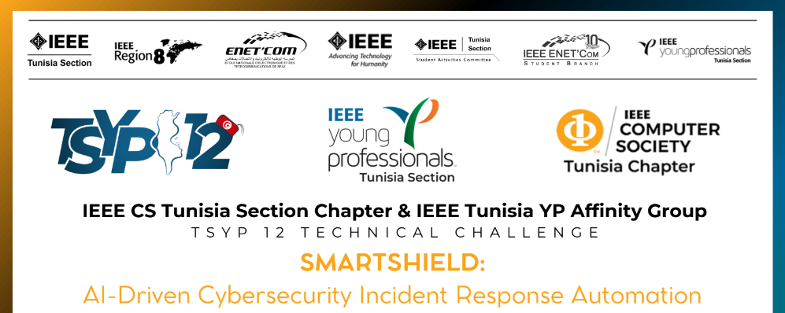

  

<h3 align="center">HydraSec: Empowering Cyber Defense with Intelligent Swarm Protection.
</h3>

  

---

<i> HydraSec is an AI-powered cybersecurity solution utilizing a swarm-based defense approach, leveraging a microservices architecture with Docker and Kubernetes to deliver scalable, adaptive, and real-time threat detection and mitigation across diverse data sources.
      <i>

## 📝 Table of Contents
- [📚 Documentation](#documentation)
- [💻 Interfaces](#interfaces)
- [🛡️ SIEM](#siem)
- [🛠️ Security_Tools](#sectools)
- [🤖 AI_Models](#ai_models)
- [⚙️ System d'Exploitations](#sysexp)
- [🏗️ Architecture and Infrastructure](#architecture_infrastructure)

## 📚 Documentation 
In this work, we have provided an in-depth exploration of the scientific aspects underpinning our solution, including comprehensive explanations of the employed AI models, their functioning, and the architectural design that supports them. [Research_Paper](https://github.com/Fares-Frini/TSYP12-CSYP-Challenge/tree/main/AI_Models)  Additionally, we documented the entire process through a detailed report that outlines how each model was trained, optimized, and evaluated. This report also features data visualizations and step-by-step breakdowns of the workflow, offering a transparent and thorough view of the methodologies and outcomes achieved in our implementation. [Report](https://github.com/Fares-Frini/TSYP12-CSYP-Challenge/tree/main/AI_Models)

## 💻 Interfaces 
In our visualization efforts, we utilized the Grafana dashboard, a flexible, user-friendly, and intuitive tool designed for displaying diverse data metrics. Grafana's capabilities allow for efficient monitoring and real-time alerting, providing deep insights into system health, security incidents, and various data streams. This enables streamlined data analysis, making it a crucial component for visualizing and understanding our models' outputs and system behavior. [Here](https://github.com/Fares-Frini/TSYP12-CSYP-Challenge/tree/main/Interfaces)

## 🛡️ SIEM 
We leveraged Wazuh, a Security Information and Event Management (SIEM) tool, to provide comprehensive security monitoring and threat detection. Wazuh's capabilities include log data aggregation, monitoring of system activity, and real-time alerting for potential threats. Its robust analysis tools enable the identification of security incidents, helping ensure system integrity and compliance. This integration enhances visibility across the infrastructure and supports rapid, data-driven decision-making to counter cyber threats effectively. [Here](https://github.com/Fares-Frini/TSYP12-CSYP-Challenge/tree/main/SIEM)

## 🛠️ Security Tools 
A key part of our solution is integrating with pre-existing tools and the broader cybersecurity ecosystem to ensure a coherent and resilient workflow. Tools such as Snort play an essential role, offering network intrusion detection and prevention capabilities. By incorporating Snort, we enhance our ability to analyze network traffic, detect suspicious patterns, and generate alerts in real-time. This integration supports seamless interoperability with other components, strengthening overall security and fostering a unified, layered defense strategy. [Here](https://github.com/Fares-Frini/TSYP12-CSYP-Challenge/tree/main/Security_Tools)

## 🤖 AI_Models 
We utilize advanced AI models to enhance cybersecurity detection and response. Reinforcement Learning is applied for endpoint protection, allowing the system to learn and adapt dynamically to new threats. Generative Adversarial Networks (GANs) are employed for malware generation and detection, improving the model's ability to recognize evolving threats. Long Short-Term Memory (LSTM) networks analyze network traffic patterns, detecting anomalous activities in real-time. Additionally, NLP with Data Augmentation is used for phishing email detection, while Unsupervised Learning aids in identifying IP profiling anomalies, enabling more effective threat identification without labeled data.
 [Here](https://github.com/Fares-Frini/TSYP12-CSYP-Challenge/tree/main/AI_Models)

## ⚙️ System d'Exploitations 
To evaluate the efficiency of our solution, we conducted extensive testing using various Linux environments. We employed Kali Linux for simulating different types of cyberattacks due to its robust suite of penetration testing tools. Additionally, we utilized Metasploitable, a deliberately vulnerable Linux machine, to simulate real-world attack scenarios. This testing approach allowed us to assess the system's detection and response capabilities comprehensively, ensuring robust performance against diverse threats in controlled conditions.
 [Here](https://github.com/Fares-Frini/TSYP12-CSYP-Challenge/tree/main/Ses)
 
 ## 🏗️ Architecture and Infrastructure
  
 
 - Network Architecture :
  
  
- DMZ Architecture :
 

| **Step**     | **Description**                                                                                                                                              |
|--------------|--------------------------------------------------------------------------------------------------------------------------------------------------------------|
| **1 + 2**    | Users gain access to **Elasticsearch** after successful authorization through **pfSense**.                                                                  |
| **3**        | **Wazuh** retrieves relevant data from the database server (**FreeNAS**).                                                                                   |
| **4**        | After analyzing the retrieved data, **Wazuh** communicates with **Grafana** to display visualized results.                                                  |
| **5**        | Concurrently, **Wazuh** sends data to the **Windows server**, which processes it using various AI models, including:                                        |
|              | • **Endpoints Protection** using Reinforcement Learning                                                                                                      |
|              | • **Malware Generation and Detection** with GAN                                                                                                             |
|              | • **Network Traffic Analysis** using LSTM                                                                                                                   |
|              | • **Phishing Mail Detection** through Data Augmentation and NLP                                                                                             |
|              | • **IP Profiling Detection** using Unsupervised Learning                                                                                                    |
| **6**        | If any anomalies or threats are detected, **Wazuh** responds by updating the **database server (FreeNAS)**.                                                 |
| **7**        | The detected anomalies are sent to **Grafana** for real-time visualization and monitoring.                                                                  |

 

